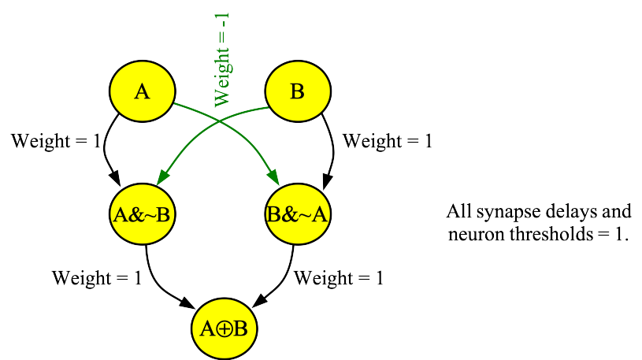

# Getting Started with the TENNLab Open-Source Framework for Neuromorphic Computing

James S. Plank

This is a walk-through for getting started with our open-source software.
You may find it useful to watch [this video](XXX) and type along as 
you do so, to help you learn what we go over in this markdown file.

------------------------------
## The Intended Environment

I will go through the activities of this markdown by typing into a Unix shell.  My machine
is a Macbook, but all flavors of Unix work.  We have tested on MacOS, Ubuntu, Red-Hat, 
Debian and Raspbian.  You should be able to use all of these tools without having to download
or install any external software packages.

In these example, I will by typing into a Unix shell.  I'm using `bash`, but you may use
what you want.  My shell prompt is `UNIX>`.

------------------------------
## Getting the software and compiling

This is a simple clone-and-make exercise.  First clone:

```
UNIX> git clone git@github.com:TENNLab-UTK/framework-open.git
Cloning into 'framework-open'...
remote: Enumerating objects: 295, done.
remote: Counting objects: 100% (295/295), done.
remote: Compressing objects: 100% (189/189), done.
remote: Total 295 (delta 76), reused 275 (delta 59), pack-reused 0 (from 0)
Receiving objects: 100% (295/295), 747.43 KiB | 6.18 MiB/s, done.
Resolving deltas: 100% (76/76), done.
UNIX> 
```

That took about three seconds.  Now `cd` into the framework directory and `make`:

```
UNIX> cd framework-open
UNIX> make
c++ -c -std=c++11 -Wall -Wextra -Iinclude -Iinclude/utils  -o obj/framework.o src/framework.cpp
c++ -c -std=c++11 -Wall -Wextra -Iinclude -Iinclude/utils  -o obj/processor_help.o src/processor_help.cpp
c++ -c -std=c++11 -Wall -Wextra -Iinclude -Iinclude/utils  -o obj/properties.o src/properties.cpp
ar r lib/libframework.a obj/framework.o obj/processor_help.o obj/properties.o
ar: creating archive lib/libframework.a
ranlib lib/libframework.a
c++ -std=c++11 -Wall -Wextra -Iinclude -Iinclude/utils  -o bin/network_tool src/network_tool.cpp lib/libframework.a
c++ -c -std=c++11 -Wall -Wextra -Iinclude -Iinclude/utils  -o obj/risp.o src/risp.cpp
c++ -c -std=c++11 -Wall -Wextra -Iinclude -Iinclude/utils  -o obj/risp_static.o src/risp_static.cpp
c++ -std=c++11 -Wall -Wextra -Iinclude -Iinclude/utils  -o bin/processor_tool_risp src/processor_tool.cpp obj/risp.o obj/risp_static.o lib/libframework.a
UNIX> ls bin
network_tool		processor_tool_risp
UNIX> 

```

Ten seconds on my Mac (96 seconds on my Pi-4, and 28 seconds on my Pi-5).
You shouldn't get any warnings, so if you do, please let me know -- I like having
no warnings.

You're good to go.

------------------------------
## RISP

RISP is a very simple neuroprocessor that implements integrate and fire neurons that feature arbitrary thresholds and unit integration cycles. Synapses have arbitrary delays and weights. The neuroprocessor may be configured so that neurons leak their charge to zero at the end of every timestep (`"leak_mode": "all")  or they retain their charge until they fire (`"leak_mode": "none", which is the
default).

"Unit integration cycle" means that neurons accumulate charge throughout each timestep, and the comparison to the threshold is only done at the end of each timestep. At the end of the timestep, if a neuron's potential meets or exceeds the neuron's threshold, then it fires and resets its potential to zero. If it is configured to leak, then any non-zero potential is reset to zero.

There are resources for RISP on the [main README for this repo](https://github.com/TENNLab-UTK/framework-open).

----------------
## A RISP neural network to implement the XOR operation

Pictured below is a neural network that computes the XOR operation on RISP with `"leak_mode":"all"`.



Specifically, it calculates the exclusive-or of two binary numbers *A* and *B*.  To provide input to
the network, you apply a spike to the *A* neuron at time zero if and only if *A's* value is one.
Same with *B*.  You then run the network for three timesteps, and observe the *(A XOR B)* neuron
at the end of timestep two (timesteps are zero-indexed).  If it fires, then *(A XOR B) = 1*.  If not, then it is zero.

The video below shows the network in action for *(A,B) = (0,0), (0,1)* and *(1,1)*.
You'll note that the only situation in which the output neuron fires is the middle network,
when *A=0* and *B=1*:

[](https://youtu.be/M3YV6avxUPw)

When you watch the video, pay attention to a few things:

- In the middle network, the *(A&~B)* neuron gets a spike whose value is -1 at the end
  of timestep 1.  That potential leaks away at the end of the timestep.
- In the middle network, the *(B&~A)* neuron spikes at the end of timestep 1.
  That's why the *A XOR B* neuron spikes at the end of timestep 2.
- In the rightmost network, both the *(A&~B)* and *(B&~A)* neurons receive spikes of 1 and -1
  at timestep 1.  That's why nothing fires.

(You may read about this network and more networks like it in [this paper](http://neuromorphic.eecs.utk.edu/publications/2021-07-29-spiking-neuromorphic-networks-for-binary-tasks/).)

