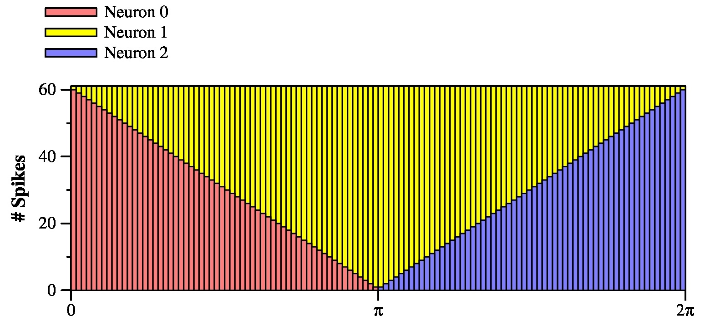

# Example of a neuromorphic implementation of the sine function.

We are going to use a RISP-7 network to approximate *sine(x)* for *x*
from 0 to *2pi*.  This network is a little different from the one in
the paper "The RISP Neuroprocessor - Open Source Support for Embedded
Neuromorphic Computing".  It works better than that network, and it
is easier to understand.

This is the network in test 35 of the testing suite.  Let's use the testing
script to create the network:

```
UNIX> sh scripts/test_risp.sh 35 yes
Passed Test 35 - A RISP-7 network to approximate sine(x)
UNIX> ls tmp*
tmp_empty_network.txt	tmp_nt_output.txt	tmp_pt_error.txt	tmp_pt_output.txt
tmp_network.txt		tmp_proc_params.txt	tmp_pt_input.txt
UNIX> 
```

The network is in `tmp_network.txt`.  Let's use the `network_tool` to give us some basic
stats:

```
UNIX> ( echo FJ tmp_network.txt ; echo INFO ) | bin/network_tool
Nodes:         40
Edges:        113
Inputs:         3
Outputs:        1

Input nodes:  0 1 2 
Hidden nodes: 6 12 51 93 11 102 42 10 30 17 7 20 62 95 77 26 80 15 41 13 101 33 8 68 64 67 9 4 34 32 88 60 16 5 22 18 
Output nodes: 3 
UNIX> 
```

So, it's a moderate-size network with 44 neurons and 113 edges.  We created it with EONS, and it
works in the following way:

## Converting inputs to spikes

- Take the interval between 0 and *2pi* and partition it into 120 evenly-sized regions.
When you have an input, identify its region as a number between 0 and 119.  So, for example:

    - 0 maps to region 0
    - 3.14 maps to region 59
    - 6.28 maps to region 119

- We're going to use an "argyle" encoder.  That takes each value and turns it into input spikes
  that go into two of three input neurons.  Suppose the region number is *r*.  Then:

    - If *r* is between 0 and 59, then input 0 gets 60-r spikes, and input 1 gets r+1 spikes.
    - If *r* is between 60 and 119, then input 1 gets 120-r spikes, and input 2 gets r-59 spikes.

The cool thing about the argyle encoder is that there are always exactly 61 spikes sent to the
input neurons.  Here's a figure of how the spikes work:



- We apply the input spikes every third timestep.  

## Running the neural network and converting the output spikes to a value

We run the spiking neural network for 240 timesteps.  We count the spikes on the output
neuron and divide by 120.  We then use that number to scale the output from -1.5 to 1.5.
So, to be precise:

```
value = (output_spikes) / 120 * 3.0 - 1.5
```
