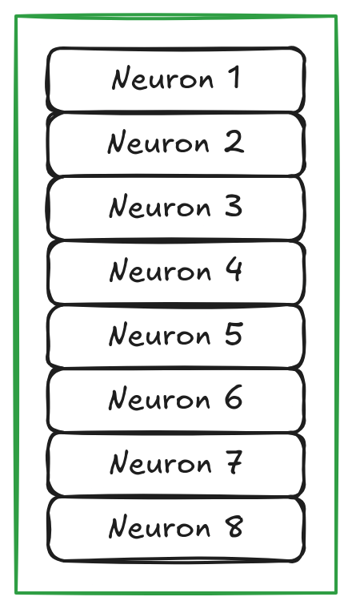
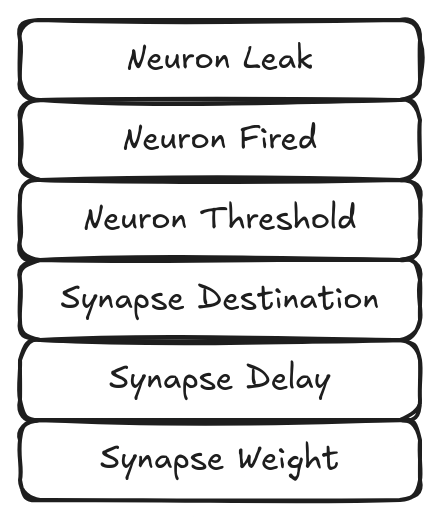
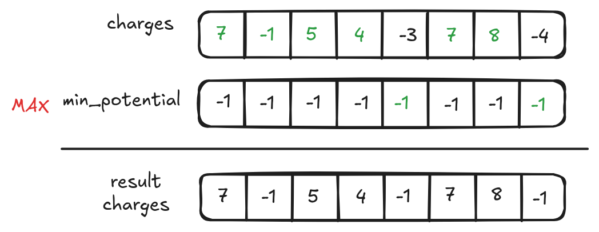
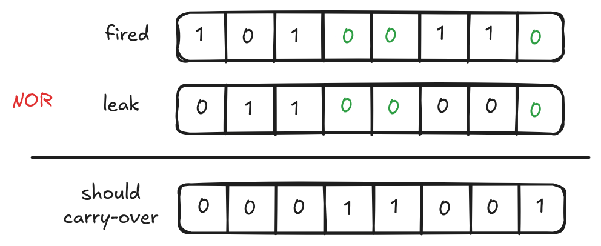
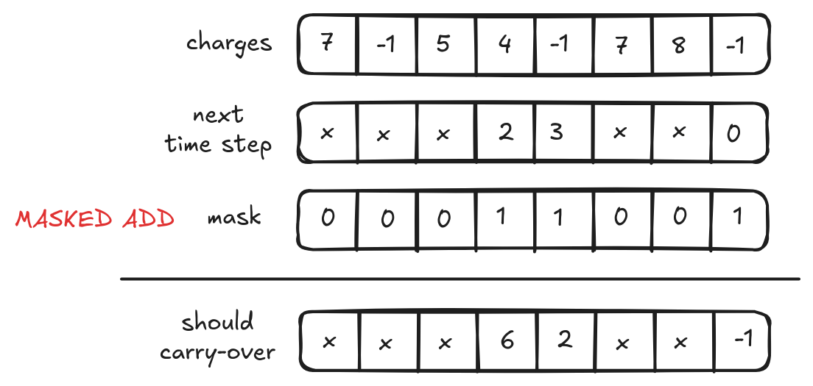
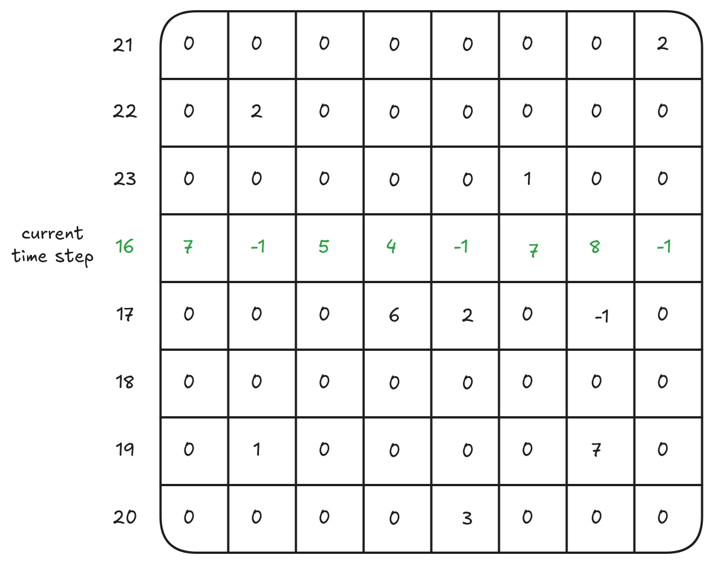
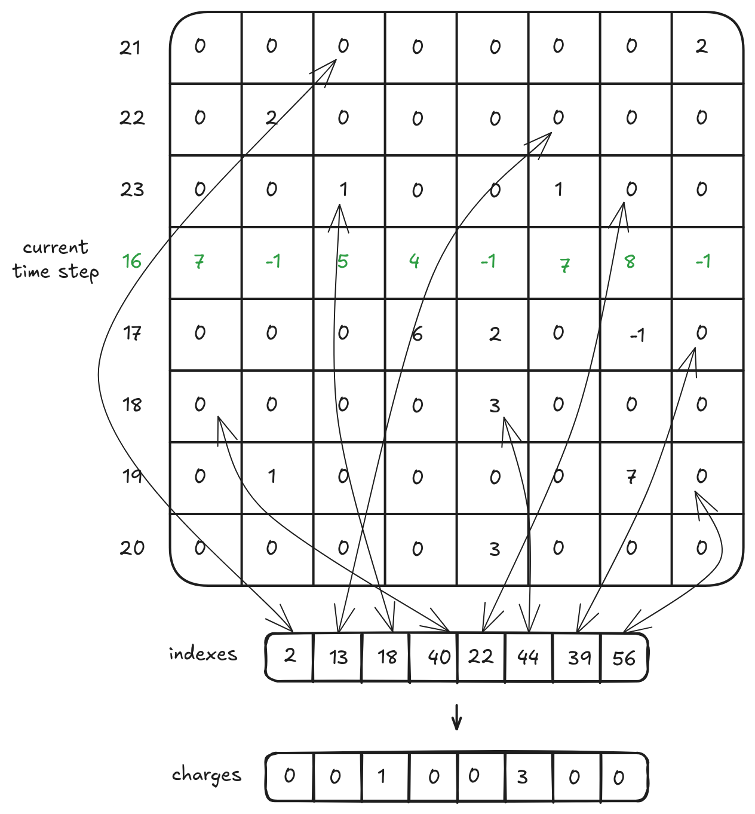

# VRISP - Vectorized Reduced Instruction Spiking Processor

Point of contact: Jackson Mowry

-----

[TOC]

-----

# Introduction

VRISP is a specialized variant of the original RISP processor, focused on optimizations to support large densely connected networks, with high levels of activity, and being run on low-power hardware. It differs from RISP on the following features.

  1. Weights, threshold and activations potentials **must** be set to integer values.
  2. A threshold value of `0` means that the neuron will fire every time step (unless it 
     is allowed to hold a charge less than `0`), even if there are no incoming spikes to the neuron.
  3. Emulation of the RAVENs neuroprocessor is not supported.
  4. Random noise addition is not supported.
  5. All run times are exclusive (same as RISP default `run_time_inclusive=false`).
  6. All thresholds are includive (same as RISP default `threshold_inclusive=true`)
  
For the above reasons, most networks trained for RISP will work exactly the same on VRISP as long as the following RISP parameters are kept the same.

```javascript
{
  "min_weight": XX,
  "max_weight": XX,
  "min_threshold": 1,
  "max_threshold": XX,
  "min_potential": XX,
  "max_delay": XX,
  "discrete": true
}

```

VRISP additionally adds the concept of `"tracked_timesteps"`, which should be set to `"max_delay" + 1`, although it can be set higher at the cost of greater memory usage. 
 
# Implementation Details

Examples here will assume an architecture where an appropriate vector length is 8 elements, though this approach can and will scale to higher vector lengths.

## Data Structures

Drawing from the simplicity of RISP, VRISP retains much the same code, changing only the sections related to simulating a network. Starting with the way a network is represented, VRISP utilizes a structure of arrays, as opposed to the array of structures that RISP uses. This means that instead of treating a neuron as a complex object that contains all of its related state (charge, threshold, fired status, and synapses), we treat each of the individual properties as its own object. The end result of this is one array for all neuron thresholds, another for their fired status, another for each synapse's weight, and so on.





This change allows us to take advantage of wider load/store instruction, present in SIMD/vector instruction sets. At a high level this means that we can perform the calculations for up to 8 neuron simultaneously. This change alone is already a great advantage over a standard scalar implementation, but there are more gains to be hard. 

## Vectorized Computation

Let's dive into how we actually compute more than one result at a time. The general process we follow for simulating a neuromorphic network is the following: reset the fired state for all neurons, bring up any charges below the minimum, calculate which neurons should fire, fire those neurons, apply leak to any neurons that have not fired. VRISP follows this process from the outside, but make some modifications internally to improve performance.

To start, VRISP requires users to specific a fixed number of `tracked_timesteps`, which determines the size of the "ring buffer" that holds each of the neurons charge for the next `n` time steps. This offers two main advantages, the memory usage of VRISP no longer grows with network activity, and we can use scatter/gather instructions to manipulate memory. We will discuss the scatter/gather instructions later, but for now we can just think of each neuron having exactly one value for its current charge, which we will use in the next section.

### Which Neurons should Fire?

To begin we load the charges for up to 8 neurons into a single vector. I say up to 8 because we only load as many as we need, meaning if we have a network with 7 neurons we will load 7 charges into a vector. Then we create another vector where each index holds the minimum potential. A simple `max` instruction gives us the greater of the two values in either vector, resulting in the beginning charges for each neuron.



The next step is to calculate which neurons have fired. Once again this requires loading values into a vector and doing an element-wise comparison, in this case a greater than or equal to. The difference here is that each neuron can have a different threshold, so the vector can contain different values at each index.


Now that we know which neurons have fired, we also know which ones to apply leak to. This is one area that is significantly different from RISP, instead of not leaking being a no-op (as the location in memory of a neurons current charge does not change between time steps), we have leaking as no-op. In VRISP when a neuron does not leak its charge we have to add that value into the next position of its ring buffer. We accomplish this by taking the `NOR` of a neuron's fired status and if it should leak. Put simply, we only want to carry over charges when a neuron has not fired `AND` shouldn't leak. 

You may have noticed that the result of the previous operation `>=` was a mask, this just means that instead of have a entire element dedicate to the result of each comparison we create a bit-mask. We can treat masks just like regular vectors and perform element-wise comparisons with other masks, and they will also allow us to selectively operation on other vectors, masking off regions which should not be operated on. Conveniently, VRISP stores both the fired and leak information in memory as these masks so they can be efficiently stored and loaded. Now we can generate our final mask for applying carry-over through the `NOR` comparison.




Now we can load the next step in the ring buffer for the current 8 neurons that we're working on and add any carry-over from the current time step. This is where the mask comes in to play, as it allows us to avoid loading/storing to any of the neurons which should not have their charge carried over (all masked out fields are represented as X's).




To finish the process or carry-over the same mask is used to write the result charges back to memory.

### Propagating Charges

Once we have determined that a neuron should fire the next step is to fire down all of its synapses. Normally this involves loop through each of the outgoing synapses one-by-one, but we can do better than that with vector instructions. Instead, we can operate of 8 synapses at once by taking advantage of the "ring buffer" structure we explained earlier.

Instead of giving each neuron its own ring buffer, we combine all neurons together into a 2D vector, with rows representing a distinct timestep, and columns representing the individual neuron. 



Now we can put this all together to demonstrate how charges are propagated. There are two axes to our matrix, time on the rows, neurons on the columns, so we need to get these two values to determine our final location in memory. Neurons are easy, we just look to see what the destination of this particular synapse is. To calculate time we need to add the delay of a particular synapse to the current time, this may result in an out-of-bounds error, so we mod by the number of tracked time steps to wrap around. 

The two values are then used to calculate a offset for each of the downstream neurons. We can then use a gather instruction to load 8 values from memory, using the offsets from the previous step which are individually added onto the base of our matrix during address generation. The weight of each synapse can then be added into its index in the vector, before storing the vector back in memory using a scatter instruction with the same offsets. 



Lastly, we clear out the current row of the matrix by setting all values to zero, as leak has already been applied. This is safe to do so as the number of tracked time steps must be at least one greater than the max delay of the network. 


-------------------------------------------------------------------------------

# Default VRISP Parameter Settings

There are only two main types of VRISP processors:
1. VRISP with positive and negative weights: `VRISP-n`
2. VRISP with only positive weights: `VRISP_n+`

You can find common configurations in the `params` directory.

```console
UNIX> ls params/*vrisp* -1
params/vrisp_127.json
params/vrisp_15_plus.json
params/vrisp_1.json
params/vrisp_1_plus.json
params/vrisp_64.json
params/vrisp_7.json
UNIX>
```

As with RISP, all of these configurations have `"leak_mode"` set to `"none"`, meaning you will need to change this setting to either `"all"` or `"configurable"` if your network requires the setting.

`VRISP-n` means that:

- Maximum synapse weight is *n*.
- Minimum synapse weight is *-n*.
- Maxiumum neuron threshold is *n*.
- Minimum neuron threshold is *0*.
- Minimum neuron potential is *-n*.
- Maximum synapse delay is *max(n,15)*.
- Tracked timesteps is *max_delay + 1*

`VRISP-n+1` means that:

- Maximum synapse weight is *n*.
- Minimum synapse weight is *1*.
- Maxiumum neuron threshold is *n*.
- Minimum neuron threshold is *1*.
- Minimum neuron potential is *0*.
- Maximum synapse delay is *max(n,15)*.
- Tracked timesteps is *max_delay + 1*

-------------------------------------------------------------------------------
# Params

You can specify the following parameters:
| Key                | Type    | Default      | Description                                                                                                                                                                               |
|--------------------|---------|--------------|-------------------------------------------------------------------------------------------------------------------------------------------------------------------------------------------|
| min_weight         | integer | Necessary    | The minimum synapse weight.                                                                                                                                                               |
| max_weight         | integer | Necessary    | The maximum snapse weight.                                                                                                                                                                |
| max_delay          | integer | Necessary    | The maximum synapse delay.                                                                                                                                                                |
| min_threshold      | integer | Necessary    | The minimum neuron threshold.                                                                                                                                                             |
| max_threshold      | integer | Necessary    | The maximum neuron threshold.                                                                                                                                                             |
| min_potential      | integer | Necessary    | At the end of integration, the potential cannot go lower than this value.                                                                                                                 |
| tracked_timesteps  | integer | Necessary    | The total number of discrete timestamps that VRISP tracks. Can generally be set to `max_delay+1`, but may be higher if one intends to apply spikes at a time step later than this allows. |
| leak_mode          | string  | "none"       | Leak: `"all"`, `"none"`, `"configurable"`                                                                                                                                                 |
| spike_value_factor | double  | `max_weight` | Framework applications call `apply_spikes()` with input spike values between 0 and 1. VRISP multiplies these values by this factor.                                                       |

------------------------------------------------------------
# Examples of Use

You can go through each of these examples with `scripts/test_vrisp.sh`.


<!--  LocalWords:  RISP VRISP neuroprocessor RAVENs javascript 
 -->
